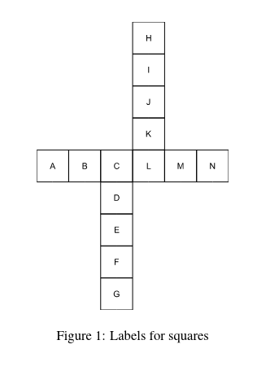

# Simple Coin Game

This is a Programming Exercise for learning C programming language.

### Premise

The Problem of the exercise is to find the shortest number of steps needed to take to reach the destination on a board given the starting position and ending position.
The position on the board is given in the form of a letter of which is represented in Figure 1.
Each position given indicates a coin either black or white represented on the board as shown in Figure 2.

Usage
---

```bash
./prog CDEF IJKL IJKL CDEF
```

To rebuild the file due to dependency:

```bash
cc -o prog prog_bin.c -std=c99
```

To use the timer.sh to calculate the real time runtime of the program:

```bash
# N represents the number of runs to average out of (default: 10)
./timer.sh -n N ./prog CDEF IJKL IJKL CEDF
```

Appendix
---



